# Expense Tracker App 💰

A simple and elegant Flutter application that helps you track your income and expenses. Built with **Flutter**, **Sqflite**, **SharedPreferences**, and **Provider**, this app allows users to manage financial transactions, categorize expenses, and view summarized reports.

---

## Features 📱

- **Dashboard** 📊
  - Total Balance, Income, and Expense display.
  - Day, Week, and Month-wise expense summaries.

-  **Categories** 🗃️
  - View expenses categorized (e.g., Food, Transport, Shopping, etc.)
  - Custom icons and color codes for each category.

-  **Add Transactions** ➕
  - Add income or expense transactions.
  - Assign category and date.
  
- **View Category Transactions** 📂
  - Tapping on a category shows all transactions in that category.

- **Theme Persistence** ⚙️
  - Toggle between dark and light themes. State is saved using Shared Preferences.

- **Snackbars** 🔔  
  - Instant feedback using Flushbar for actions like adding, editing, deleting & data entry errors.

---

## 📸 Screenshots
### **Home Page**
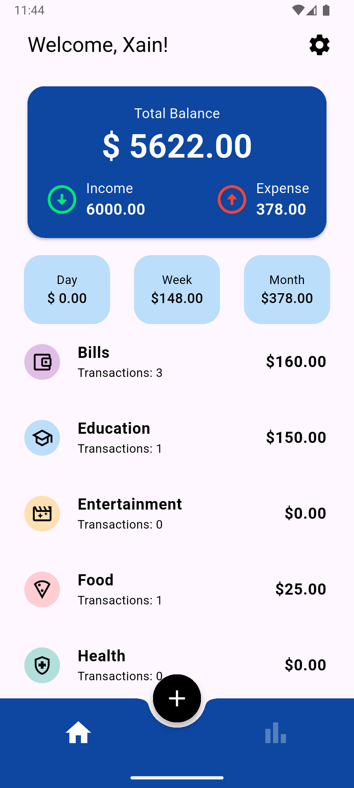

### **View Categorized Expenses**
> Tap on any category to explore its expenses.

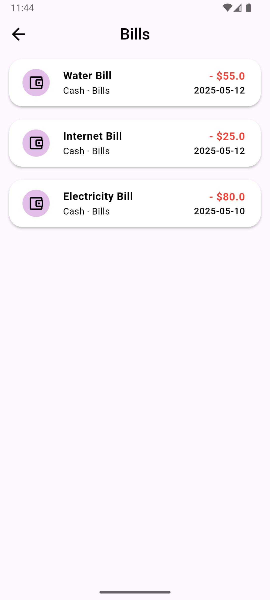
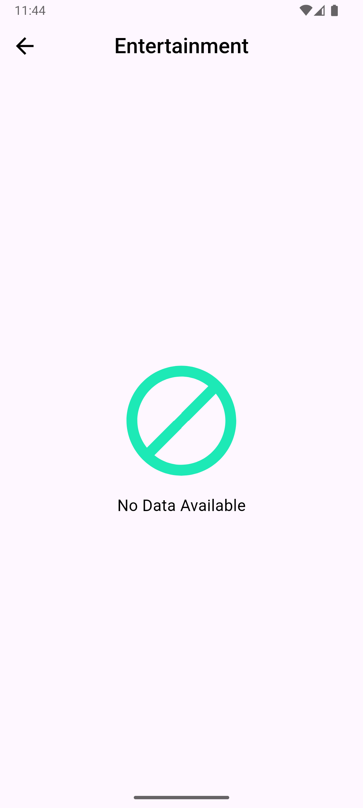

### **Add Transaction Bottom Sheet**
> Add a new transaction, choose category, amount, and date.

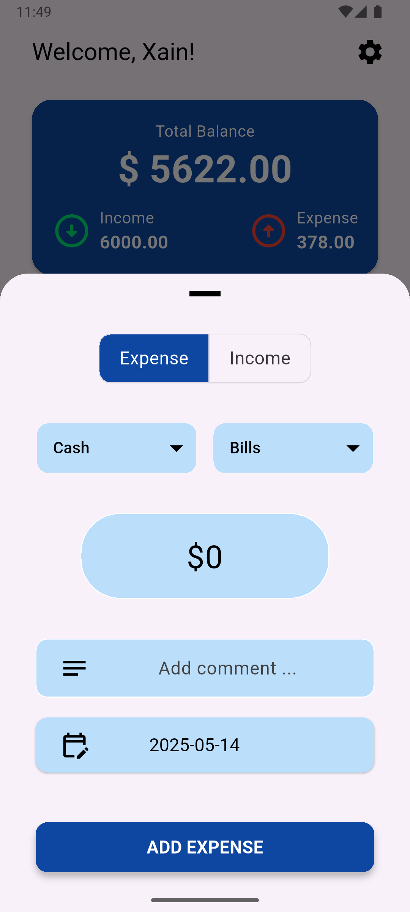
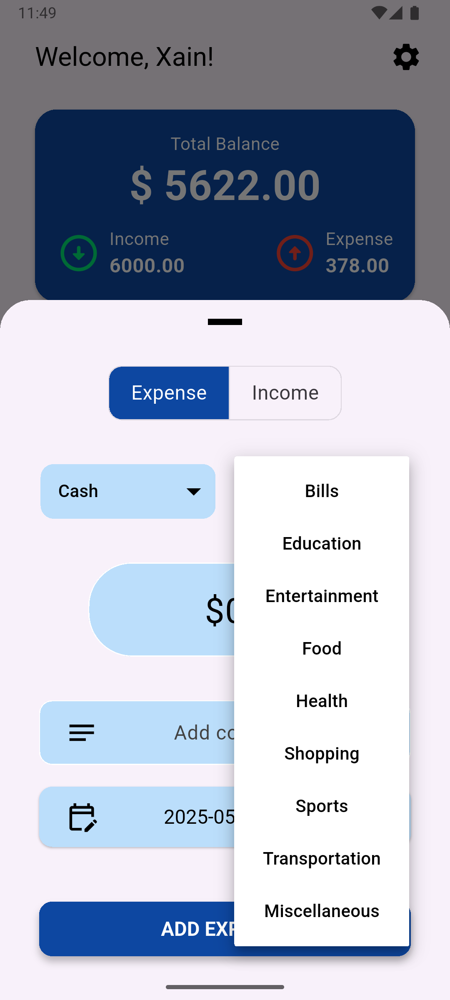

### **Update Transaction Bottom Sheet**
> Swipe left or right on any income or expense item to quickly edit or delete it.

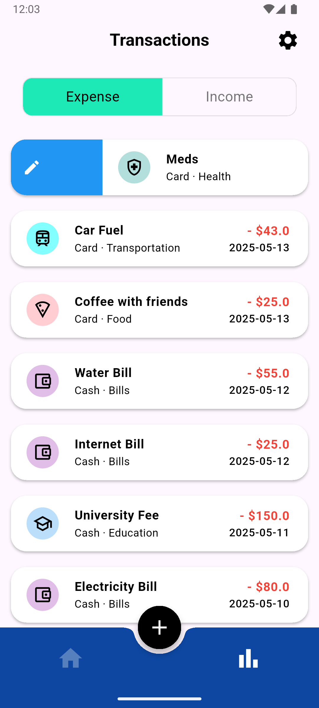
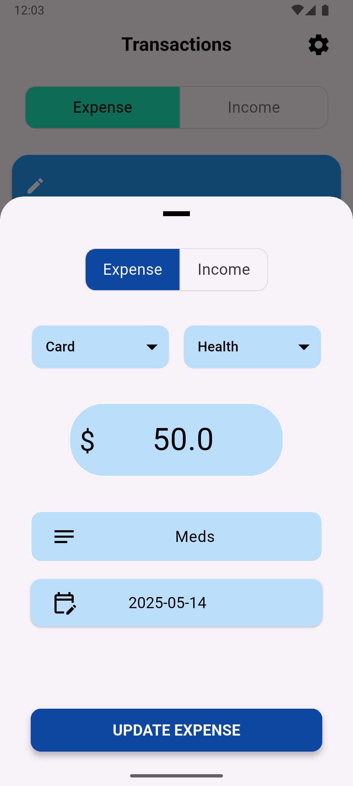

### **Transactions Page**
> Toggle between expense and income to view full history.

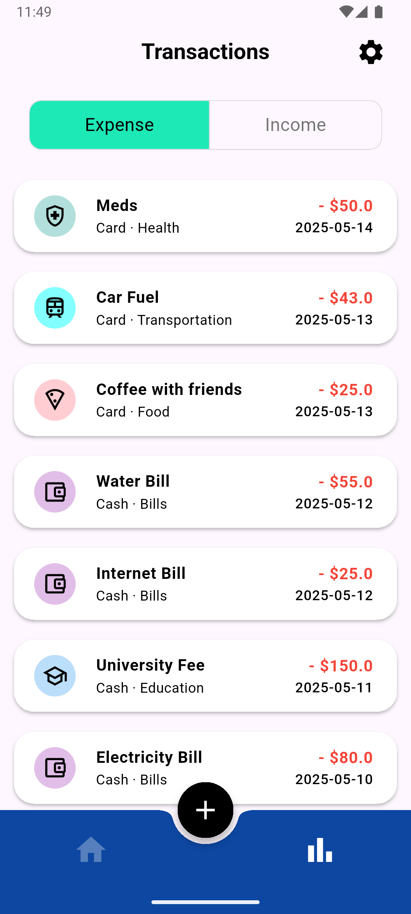
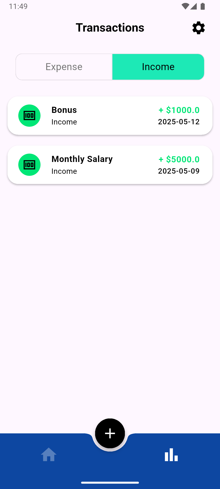

### **Settings Page**
> Easily switch between light and dark themes.

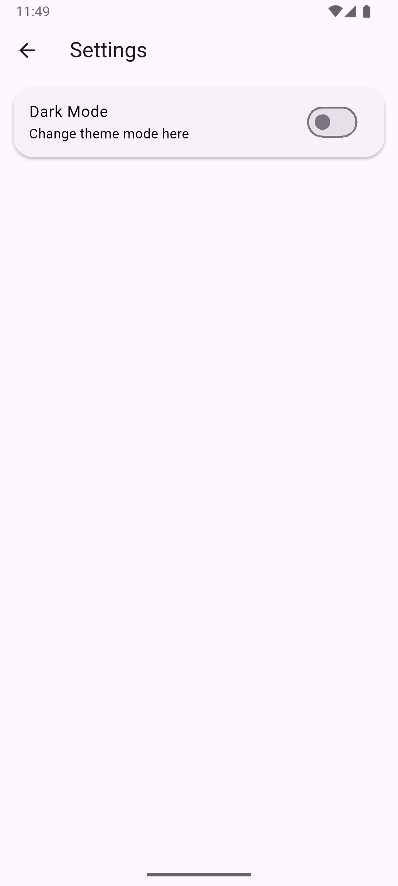
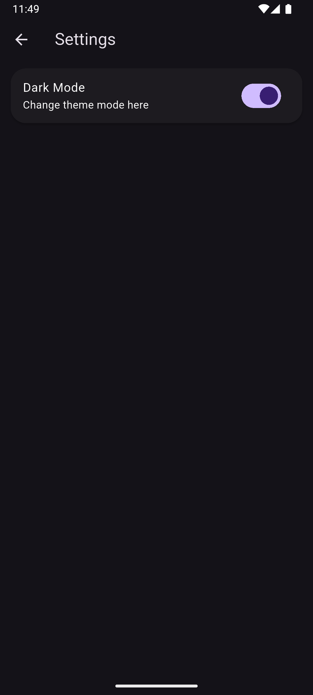

### **Dark Theme**

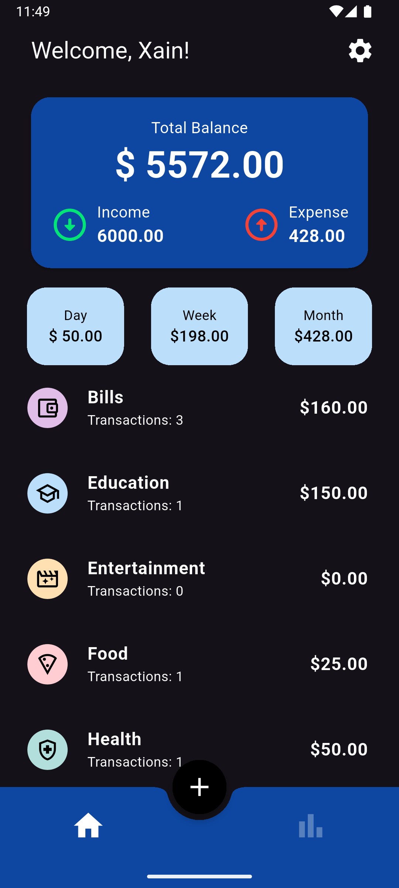
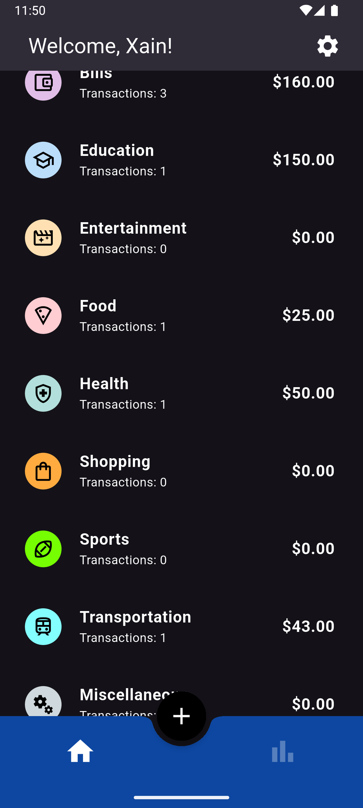
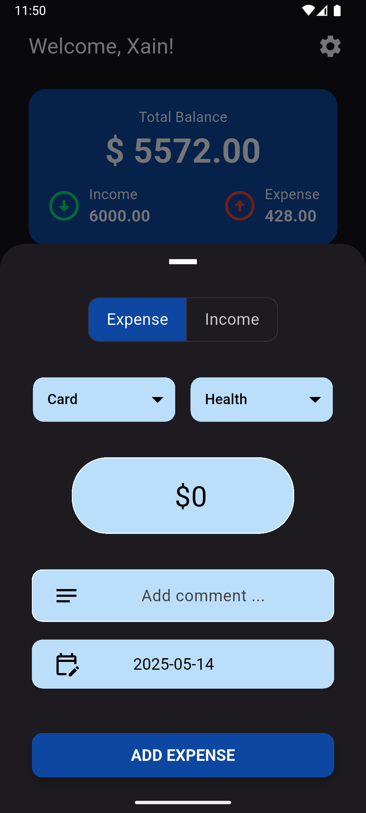

---

## Dependencies 📦
This project uses the following dependencies:

- [`provider`](https://pub.dev/packages/provider): State management solution built on top of InheritedWidget.
- [`sqflite`](https://pub.dev/packages/sqflite): SQLite plugin for Flutter to store and retrieve structured data.
- [`path_provider`](https://pub.dev/packages/path_provider): Provides commonly used locations on the filesystem.
- [`path`](https://pub.dev/packages/path): A package for working with file and directory paths.
- [`shared_preferences`](https://pub.dev/packages/shared_preferences): Used to persist theme preference across app sessions.
- [`another_flushbar`](https://pub.dev/packages/another_flushbar): Beautiful and customizable snackbars for user feedback.

---

##  Tech Stack 🛠️
- **Flutter**: UI toolkit for building natively compiled applications.
- **Dart**: Programming language used by Flutter.
- **SQLite + sqflite**: Lightweight local database solution.
- **Provider**: Simplified and scalable state management.
- **Shared Preferences**: Lightweight storage for user preferences.
- **Flushbar** – Enhanced snackbar alerts.
- **VS Code / Android Studio**: Development environments.
- **Git**: Version control.
---